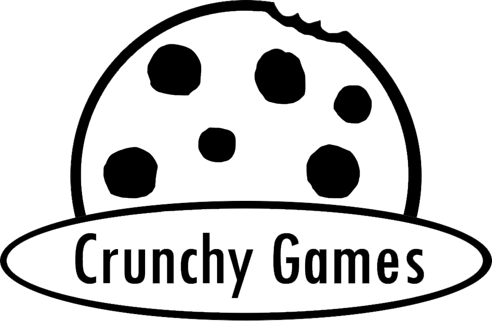

# CRUNCHY

**CONTACTS**

All contacts listed are okay ways to contact us.
| Person | Email | Discord |
| --- | --- | --- |
| Dominic Kolp | stupidlilgoober@gmail.com | stupidlilgoober |
| David Swarthout | dthdree14812@gmail.com | the_fred_hehe |
| NCSources0 |
| Austin |

Also, one of our guys has a YT channel [here](https://youtube.com/@ambailgail?si=ra9xS-KU4PCYLrmI).
Fair warning, he's kind of an odd ball.

Crunchy Games is a team of 4 goobers, founded
by Dominic Kolp ( @stupidlilgoober ) and David
Swarthout (@QR-cre8tes ) at a school lunch table.

With Dom and @NCsources0 as programmers,
Ben ( @ThisThis48 ) for sound design, David as designer
and founder ( Dom is co-founder ) and IDK ( that's her
nickname... she doesn't have a GitHub ), we make some
random things once in a while.

## What are we working on?
We are currently working on an idle game about
dwarves, mining, and collecting gold.

co-founder's personal [website](https://StupidLilGoober.github.io).

## Meet the team
| Member | Role(s) |
| --- | --- |
| David Swarthout | Founder |
| Dominic Kolp | Co-Founder and programmer |
| NCSources0 (anonymous) | Web design |
| IDK (anonymous) | Artist |
| Benjamin Sauter | Music & SFX |

## Are we chill with modding?
Absolutely! Most games have built-in modding support
through Lua, and all of our free games (including demos) are
open source.

Once we stop working on the game, we will open source
the game so that people who enjoy the game can continue
it.

We love the gaming, modding, and programming community. The
collaboration achieved matches almost no other medium, 
and that's impressive!

## Policies
[Policies](POLICIES)

## Tech we use
Our primary language is C and
Lua for scripting and config filesso that everyone is capable
of working on the games.

For the web, we do it the most bog-standard way possible. We raw-dog
HTML, CSS and JS just as God intended.

