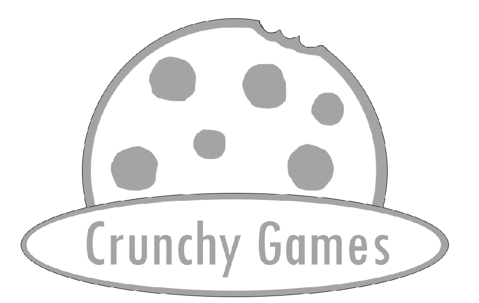

# CRUNCHY

**CONTACTS**
All contacts listed are okay ways to contact us.
| Email | Discord | Person |
| --- | --- | --- |
| stupidlilgoober@gmail.com | stupidlilgoober | Dominic Kolp |
| three14812@gmail.com | the_fred_hehe | David Swarthout |

Also, one of our guys has a YT channel [here](https://youtube.com/@ambailgail?si=ra9xS-KU4PCYLrmI).
Fair warning, he's kind of an odd ball.

Crunchy Games is a team of 4 goobers, founded
by Dominic Kolp ( @stupidlilgoober ) and David
Swarthout (@QR-cre8tes ) at a school lunch table.

With Dom and Nathaniel ( @NCsources0 ) as programmers,
Ben ( @ThisThis48 ) for sound design, David as designer
and founder ( Dom is co-founder ) and IDK ( that's her
nickname... she doesn't have a GitHub ), we make some
random things once in a while.

## What are we working on?
Tons of miscellaneous things. We don't really have much
of a direction as of current, as most of us are unskilled,
but we are open for suggestions. You can also find the
co-founder's personal [website.](https://StupidLilGoober.github.io)

## Meet the team
| Member | Role(s) |
| --- | --- |
| David Swarthout | Founder |
| Dominic Kolp | Co-Founder and programmer |
| Nathaniel Carlton | Programmer (JS genius) |
| IDK (anonymous) | Artist |
| Benjamin Sauter | Music & SFX |

## Licenses, Guidelines, etc.
[Copying rules](COPYING)
